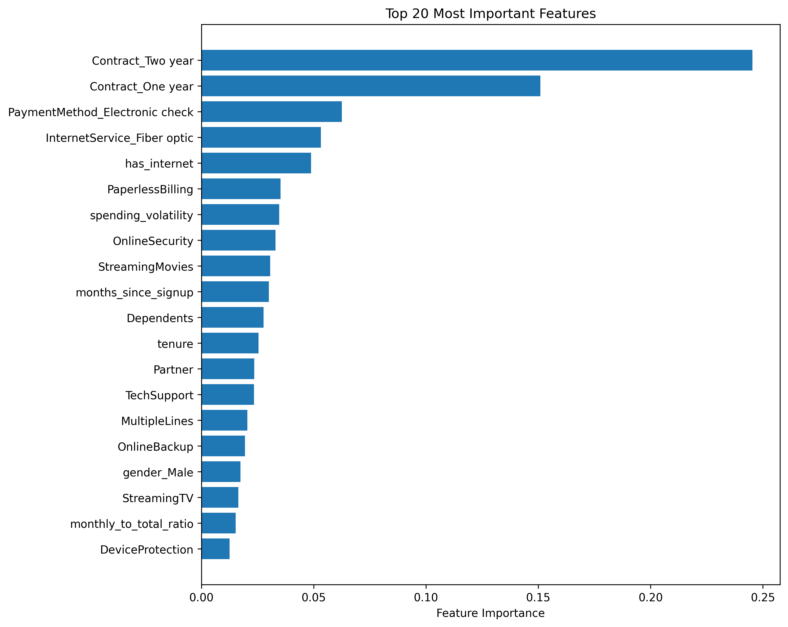
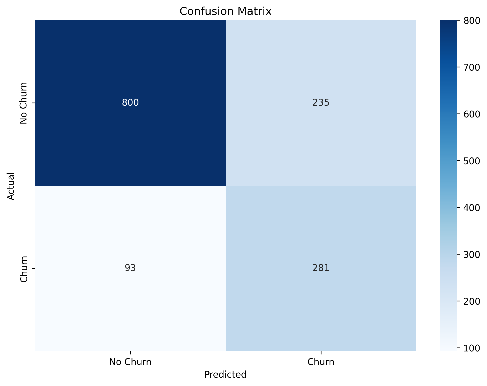
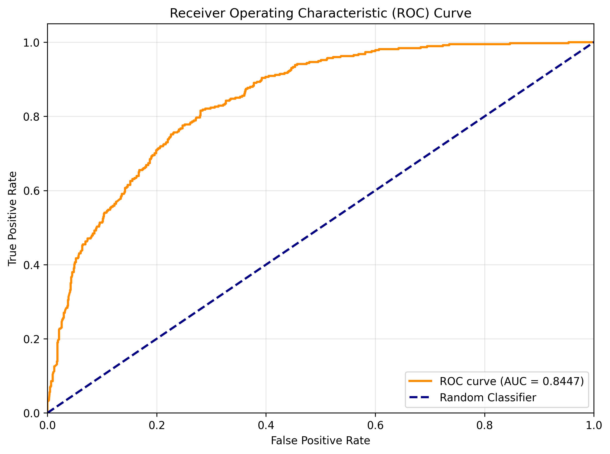
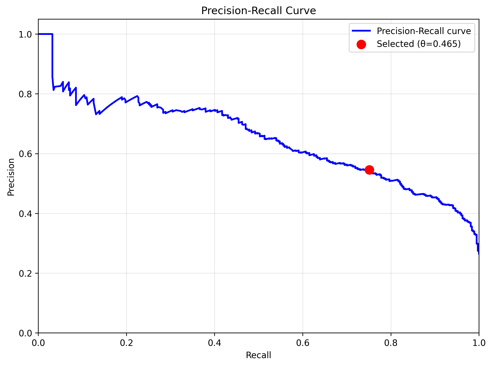
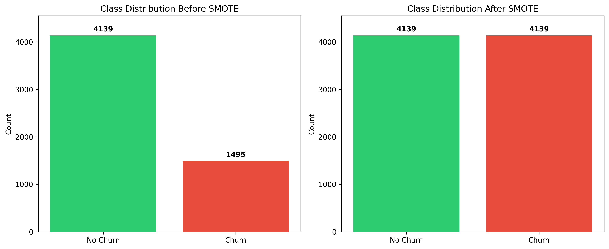
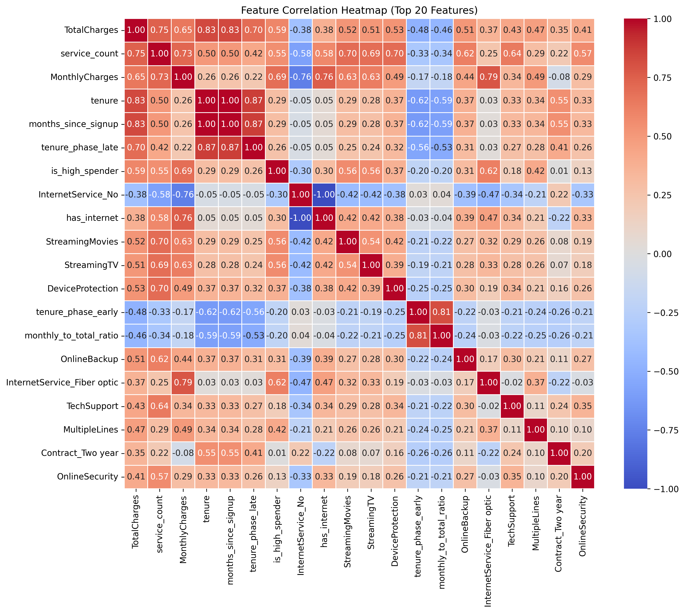
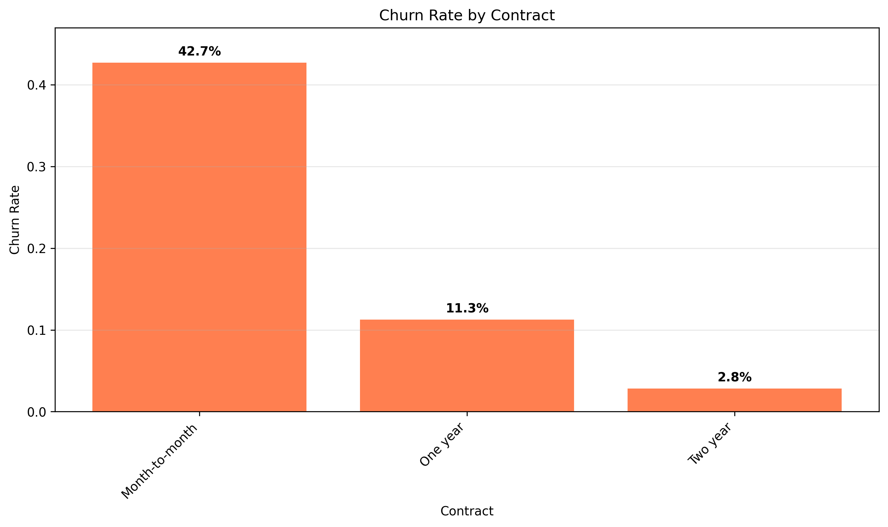

# Telco Customer Churn Prediction with XGBoost

[](https://www.python.org/)
[](https://xgboost.readthedocs.io/)
[](https://docs.pytest.org/)

Production-style churn prediction project using XGBoost on the Telco Customer Churn dataset, with modular pipeline code, notebooks, dual CLI interfaces, and automated tests.

---

## Project Overview

This project predicts whether a customer will churn (`Yes`/`No`) using structured customer profile and service features.

### Key Features

- Menu-driven CLI for interactive usage
- Argparse CLI for scripting/automation
- End-to-end training pipeline (load -> preprocess -> split -> scale -> train -> evaluate -> save)
- Reusable modules under `src/models` and `src/utils`
- Notebook workflow for EDA and preprocessing
- Unit + integration test suite with pytest

---

## Dataset

- **Source**: [Telco Customer Churn Dataset](https://www.kaggle.com/datasets/blastchar/telco-customer-churn/data)
- **Type**: Binary classification
- **Target**: `Churn` (`Yes`/`No`)

### Data Access

To download from Kaggle API:

1. Create an account on [Kaggle](https://www.kaggle.com/)
2. Go to Account Settings -> API -> Create New API Token
3. Place `kaggle.json` in `~/.kaggle/`
4. Set permissions:

```bash
chmod 600 ~/.kaggle/kaggle.json
```

---

## Project Structure

```
ML-XGBoost/
├── data/                   # Raw dataset (gitignored)
├── docs/
│   └── images/             # README visuals
├── models/                 # Saved model/scaler artifacts (gitignored)
├── notebooks/              # 01_EDA, 02_Data_Preprocessing
├── output/                 # Generated plots/artifacts (gitignored)
├── src/
│   ├── models/
│   │   └── xgboost_model.py
│   ├── utils/
│   │   ├── data.py
│   │   ├── data_download.py
│   │   └── evaluation.py
│   ├── download_data.py    # Legacy wrapper
│   └── train_model.py      # Legacy wrapper
├── tests/                  # Unit + integration tests
├── DESIGN.md               # Architecture/design notes
├── main.py                 # Interactive menu CLI
├── main_argparse.py        # Argument-based CLI
├── pytest.ini
├── requirements.txt
└── README.md
```

---

## Quick Start

### 1) Install dependencies

```bash
pip install -r requirements.txt
```

### 2) Download data

```bash
python main_argparse.py download
```

### 3) Train + evaluate model

```bash
python main_argparse.py train
```

### 4) Run tests

```bash
python -m pytest -q
```

---

## CLI Interfaces

### Interactive Menu (`main.py`)

```bash
python main.py
```

Menu options:

1. Download dataset
2. Train XGBoost model
3. View generated visualizations
4. Run unit tests
5. Exit

### Argparse CLI (`main_argparse.py`)

```bash
# Download
python main_argparse.py download --data-dir data

# Train with defaults (feature engineering + SMOTE enabled)
python main_argparse.py train \
  --data-path data/WA_Fn-UseC_-Telco-Customer-Churn.csv \
  --models-dir models \
  --output-dir output \
  --test-size 0.2 \
  --random-state 42

# Train with hyperparameter tuning
python main_argparse.py train \
   --tune-hyperparameters \
   --tuning-iterations 15

# Train with threshold tuning controls
python main_argparse.py train \
   --min-precision 0.60

# Disable threshold tuning (use default threshold=0.5)
python main_argparse.py train \
   --no-threshold-tuning

# Disable SMOTE oversampling (process raw imbalanced data)
python main_argparse.py train \
   --no-smote

# Disable feature engineering (use raw features only)
python main_argparse.py train \
   --no-feature-engineering

# Combine: tuning + SMOTE + custom threshold
python main_argparse.py train \
   --tune-hyperparameters \
   --tuning-iterations 20 \
   --min-precision 0.65

# Test
python main_argparse.py test
```

### Legacy Script Compatibility

```bash
python src/download_data.py
python src/train_model.py
```

---

## Modeling Pipeline

The training pipeline in `src/models/xgboost_model.py` performs:

1. Load CSV dataset
2. **Feature Engineering** (optional, enabled by default):
   - Tenure phases: early (0-6mo), mid (6-24mo), late (24+ mo)
   - Spending patterns: monthly-to-total ratio, high-spender flags, volatility
   - Service adoption: total service count, internet availability
3. Preprocess data:
   - Convert `TotalCharges` to numeric
   - Fill missing values
   - Encode binary/service/categorical features
4. Train-test split with stratification
5. Standard scaling
6. **SMOTE Oversampling** (optional, enabled by default):
   - Synthetically balances minority class (churn) to match majority
   - Better recall and F1-score for imbalanced data
   - Applied only to training set (test set remains representative)
7. Train `XGBClassifier` (binary classification)
8. **Threshold Optimization** (enabled by default):
   - Uses precision-recall curve to find optimal decision threshold
   - Defaults to 0.5 if disabled
   - Supports optional minimum precision constraint
9. Evaluate on test set:
   - Accuracy, Precision, Recall, F1-score, ROC-AUC
   - Reports selected threshold and estimated metrics
10. Generate comprehensive visualizations (11 plots total)
11. Save model + scaler

### Advanced Options

**Hyperparameter Tuning**: Randomized search over 9 parameters (n_estimators, max_depth, learning_rate, subsample, colsample_bytree, min_child_weight, gamma, reg_alpha, reg_lambda) using 3-fold stratified CV and F1 scoring.

**Class Imbalance Handling**: 
  - Automatic `scale_pos_weight` calculation (ratio of neg to pos samples)
  - SMOTE synthetic oversampling as alternative/complement

---

## Outputs and Artifacts

### Saved Model Artifacts (`models/`)

- `xgboost_churn_model.pkl` - Trained XGBoost classifier
- `scaler.pkl` - StandardScaler for feature normalization

### Generated Visualizations (`output/`)

The training pipeline generates 12 comprehensive visualizations for model evaluation and business insights:

**Core Model Evaluation:**
- `feature_importance.png` - Top 20 most important features
- `confusion_matrix.png` - Classification performance matrix

<p align="center">
  
  
</p>

**Performance Curves:**
- `roc_curve.png` - Receiver Operating Characteristic with AUC score
- `precision_recall_curve.png` - Precision-Recall tradeoff with selected threshold marker
- `threshold_vs_metrics.png` - How precision, recall, and F1 vary across thresholds

<p align="center">
  
  
</p>

**Model Quality Analysis:**
- `calibration_curve.png` - Probability calibration assessment
- `learning_curves.png` - Training vs validation performance (detects overfitting)

**Data & Feature Analysis:**
- `class_distribution_smote.png` - Class balance before/after SMOTE oversampling
- `feature_correlation_heatmap.png` - Top 20 feature correlations (multicollinearity detection)

<p align="center">
  
  
</p>

**Business Insights:**
- `churn_rate_by_contract.png` - Churn rate by contract type
- `churn_rate_by_internetservice.png` - Churn rate by internet service
- `churn_rate_by_paymentmethod.png` - Churn rate by payment method

<p align="center">
  
</p>

All plots are saved at 300 DPI for publication quality.

**Viewing Visualizations:**
After training, use menu option 3 (`python main.py` → "View generated visualizations") to display all plots in a single matplotlib window with an interactive grid layout. This prevents multiple application instances from cluttering your dock. The matplotlib viewer allows you to zoom, pan, and save individual plots as needed.

---

## Notebooks

- `notebooks/01_EDA.ipynb` – exploratory data analysis and churn insights
- `notebooks/02_Data_Preprocessing.ipynb` – cleaning, encoding, and preprocessing flow

---

## Testing

Current test suite includes unit and integration tests for:

- Data loading and preprocessing
- Feature engineering (tenure phases, spending trends, service adoption)
- SMOTE oversampling and class balancing
- Evaluation metrics and plot generation
- All 11 visualization functions (ROC, PR curves, calibration, learning curves, etc.)
- Model initialization and defaults
- Full pipeline integration (artifact creation)
- Interactive and argparse CLI dispatch paths
- Threshold tuning functionality

**50+ tests total**, all passing.

Run all tests:

```bash
python -m pytest -q
```

---

## Productionizing Blueprint

If you want to productionize this project, here is a pragmatic, system-level blueprint. Full details live in [docs/PRODUCTION.md](docs/PRODUCTION.md).

**Core components:**
- Data ingestion + validation (schema checks, nulls, ranges, drift signals)
- Feature pipeline (single source of truth for training and inference)
- Training pipeline (reproducible runs, model registry, metrics tracking)
- Serving layer (batch or real-time API with preprocessing + postprocessing)
- Monitoring (latency, errors, data drift, performance decay, alerts)
- Governance (model cards, auditability, access controls)

**Suggested repo layout (production-ready):**

```
ml-xgboost/
├── configs/                # Environment configs (dev/stage/prod)
├── data/                   # Raw data (ingested, versioned)
├── features/               # Feature pipeline definitions
├── models/                 # Model artifacts + registry metadata
├── monitoring/             # Drift + performance checks
├── pipelines/              # Training + batch scoring jobs
├── services/               # Online inference service (API)
├── src/                    # Core library code
├── tests/                  # Unit + integration tests
└── docs/                   # Documentation (runbooks, model cards)
```

---

## Development Notes

- Style: PEP 8 + type hints
- Architecture: modular pipeline (`src/models`, `src/utils`)
- Design details: see `DESIGN.md`

## Governance

- Responsible AI framework and guardrails: [docs/GOVERNANCE.md](docs/GOVERNANCE.md)

---

## Future Enhancements

**Completed** ✅:
- Feature engineering (tenure phases, spending trends, service adoption)
- SMOTE oversampling for class imbalance
- Hyperparameter tuning with RandomizedSearchCV
- Threshold optimization with precision-recall curves
- **Comprehensive visualization suite (11 plots)**: ROC, PR curves, calibration, learning curves, feature correlation, business insights
- Extensive test suite (50+ tests covering data, eval, models, CLI, pipeline, visualizations)

**Planned** 🔮:
- Add standalone inference/predict command from saved model
- Add ROI-based threshold optimization (custom business metrics)
- Add cross-validation reporting
- Add coverage report in CI
- Add deployment-ready API endpoint (FastAPI/Flask)
- Add SHAP explanations for individual predictions
